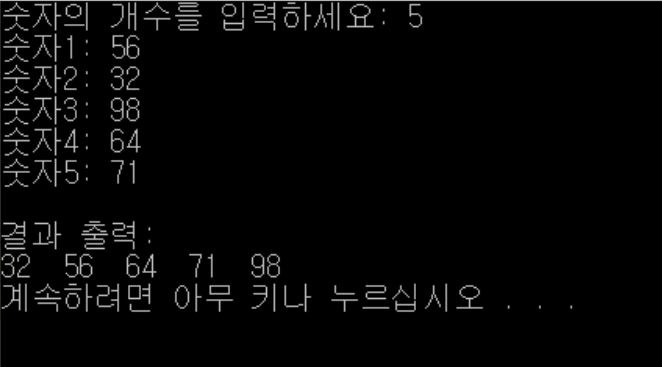

# Bubble Sort 버블정렬
두 개의 인접한 원소를 비교하여 정렬하는 방식

***
## 장점
* 구현이 간단하다.
* 데이터를 하나씩 비교하기 때문에 정밀한 비교가 가능하다.
## 단점
* 데이터를 하나씩 비교하기 때문에 비교 횟수가 많아지므로 시간이 오래 걸린다.
***
## 방법
숫자를 입력받아서, 그 숫자만큼의 버블 정렬을 하는 방식
1. 앞에서 부터 현재 원소와 바로 다음의 원소를 비교한다.
2. 현재 원소가 다음 원소보다 크면 해당 원소를 교환한다.
3. 다음 원소로 이동하여 해당 원소와 그 다음원소를 비교한다.

```java
public class Bubble{
    public static void main(String[] args){
        BufferedReader br = new BufferedReader(new InputStreamReader(System.in));
        
        System.out.print("숫자의 개수를 입력하세요: ");
        int numSu = Integer.parseInt(br.readLine());
        int num[] = new int[numSu];
        int temp;
        int number = 1;
        
        for(int i=0; i<num.length; i++){
            System.out.print("숫자" + number + ": ");
            num[i] = Integer.parseInt(br.readLine());
            number++;
        }
        for(int a=0; a < num.length-1; a++){
            for (int b=0; b<num.length-1; b++){
                if(num[b] > num[b+1]){
                    temp = num[b];
                    num[b] = num[b+1];
                    num[b+1] = temp;
                }
            }
        }
        System.out.println();
        System.out.println("결과 출력: ");
        for (int z=0; z<num.length; z++){
            System.out.print(num[z] + " ");
        }
        System.out.println();
    }
}
```

## 결과
 


